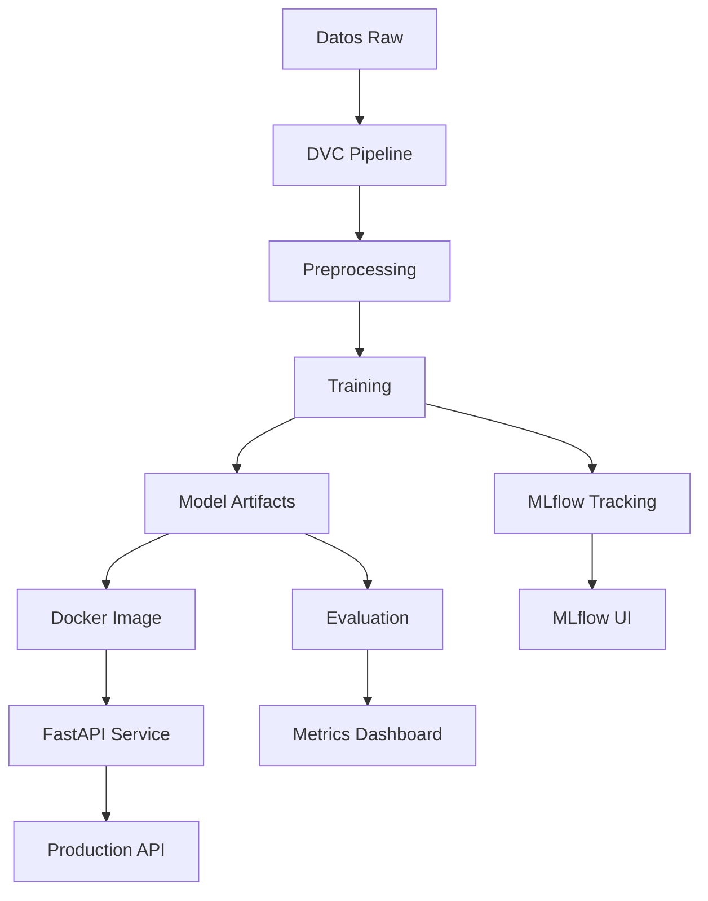

# MLOps Example – Implementación práctica en Ingeniería de Software

Este proyecto es una **implementación funcional de MLOps (Machine Learning Operations)**, aplicada al contexto de la **ingeniería de software**.  
Su objetivo es demostrar cómo automatizar el ciclo de vida completo de un modelo de Machine Learning: desde el entrenamiento hasta el despliegue y la monitorización, usando herramientas abiertas y pipelines reproducibles.

---

## ¿Qué hace este programa?

Este sistema entrena un modelo de **regresión lineal** para predecir el **precio estimado de una vivienda** a partir de variables simples:
- Número de habitaciones (`rooms`)
- Área en metros cuadrados (`area`)
- Antigüedad (`age`)

Incluye:
- Generación de datos sintéticos (si no hay dataset)
- Entrenamiento y evaluación del modelo
- API REST (con FastAPI) para realizar predicciones
- Control de versiones de datos y modelos con DVC
- Tracking de experimentos con MLflow
- Containerización con Docker para deployment

---

## Implementación MLOps del Proyecto

### Stack Tecnológico MLOps

| Herramienta | Propósito | Implementación |
|-------------|-----------|----------------|
| **MLflow** | Experiment Tracking & Model Registry | Registro automático de métricas y modelos |
| **DVC** | Data Version Control & Pipeline Management | Pipeline declarativo y versionado de datos |
| **Docker** | Containerización & Deployment | Imagen lista para producción |
| **FastAPI** | Model Serving & API | REST API con validación automática |
| **scikit-learn** | Machine Learning Framework | Modelo de regresión lineal |
| **GitHub** | Source Code Management | Control de versiones y colaboración |

### Arquitectura MLOps



### 1. MLflow - Experiment Tracking & Model Registry

**Ubicación**: Integrado en `src/train.py`

```python
# Tracking automático de experimentos
mlflow.set_experiment('mlops-example')
with mlflow.start_run():
    score = model.score(X_test, y_test)
    mlflow.log_metric('r2_score', float(score))
    mlflow.log_artifact('models/model.pkl')
```

**Características implementadas**:
- ✅ **Experiment Tracking**: Registro automático de métricas (R² score)
- ✅ **Model Registry**: Versionado de modelos con metadatos
- ✅ **Artifact Storage**: Almacenamiento de modelos entrenados
- ✅ **Reproducibilidad**: Tracking completo de parámetros y resultados

**Uso**:
```bash
# Iniciar MLflow UI
mlflow ui
# Acceder a: http://localhost:5000
```

### 2. DVC - Data Version Control & Pipeline Management

**Ubicación**: `dvc.yaml`

```yaml
stages:
  preprocess:    # Etapa de preprocesamiento de datos
    cmd: python src/train.py --preprocess-only
    outs:
      - data/processed/housing.csv
      
  train:         # Etapa de entrenamiento del modelo
    cmd: python src/train.py
    deps:
      - data/processed/housing.csv
    outs:
      - models/model.pkl
      
  evaluate:      # Etapa de evaluación y métricas
    cmd: python src/evaluate.py
    deps:
      - models/model.pkl
      - data/processed/housing.csv
```

**Características implementadas**:
- ✅ **Pipeline Declarativo**: Definición clara de dependencias entre etapas
- ✅ **Reproducibilidad**: Ejecución determinística del pipeline
- ✅ **Incremental Builds**: Solo re-ejecuta etapas con cambios
- ✅ **Data Lineage**: Tracking de dependencias de datos

**Uso**:
```bash
# Ejecutar pipeline completo
dvc repro

# Ejecutar solo una etapa
dvc repro train

# Ver estado del pipeline
dvc dag
```

### 3. Docker - Containerización & Deployment

**Ubicación**: `Dockerfile`

```dockerfile
FROM python:3.10-slim
WORKDIR /app

# Instalación de dependencias
COPY requirements.txt .
RUN pip install --no-cache-dir -r requirements.txt

# Copia de código y modelos
COPY src/ ./src
COPY models/ ./models

# Configuración del servicio
EXPOSE 8000
CMD ["uvicorn", "src.predict:app", "--host", "0.0.0.0", "--port", "8000"]
```

**Características implementadas**:
- ✅ **Portabilidad**: Mismo entorno en desarrollo y producción
- ✅ **Consistency**: Elimina problemas de dependencias
- ✅ **Scalability**: Fácil escalado horizontal
- ✅ **Isolation**: Encapsulación completa del entorno

**Uso**:
```bash
# Construir imagen
docker build -t mlops-example .

# Ejecutar contenedor
docker run -p 8000:8000 mlops-example

# Acceder a API: http://localhost:8000/docs
```

### 4. FastAPI - Model Serving & API

**Ubicación**: `src/predict.py`

```python
# API REST con validación automática
@app.post('/predict')
def predict(body: RequestBody):
    """Endpoint para predicciones de precios de viviendas"""
    if model is None:
        raise HTTPException(status_code=503, detail='Model not available')
    
    x = np.array([[body.rooms, body.area, body.age]])
    pred = model.predict(x)[0]
    return {'predicted_price': float(pred)}

@app.get('/health')
def health():
    """Health check para monitoreo"""
    return {'status':'ok', 'model_loaded': model is not None}
```

**Características implementadas**:
- ✅ **REST API**: Endpoints para predicciones en tiempo real
- ✅ **Data Validation**: Validación automática con Pydantic
- ✅ **Auto Documentation**: Swagger UI automático
- ✅ **Health Monitoring**: Endpoints para verificar estado del servicio
- ✅ **Error Handling**: Manejo robusto de errores

### 📏 5. Automated Testing & Evaluation

**Ubicación**: `src/evaluate.py`

```python
# Evaluación automática del modelo
preds = model.predict(X_test)
r2 = r2_score(y_test, preds)                    # Coeficiente de determinación
mae = mean_absolute_error(y_test, preds)        # Error absoluto medio

print(f'R2: {r2:.4f}')    # Calidad del ajuste (0-1)
print(f'MAE: {mae:.2f}')  # Error promedio en unidades de precio
```

**Métricas implementadas**:
- ✅ **R² Score**: Porcentaje de varianza explicada por el modelo
- ✅ **MAE**: Error absoluto medio en unidades monetarias
- ✅ **Automated Evaluation**: Evaluación automática post-entrenamiento
- ✅ **Reproducible Metrics**: Misma partición de datos para comparabilidad

---

## Flujo MLOps Completo

### Pipeline de Desarrollo

1. **Desarrollo Local**:
   ```bash
   # 1. Entrenar modelo
   python src/train.py
   
   # 2. Evaluar rendimiento
   python src/evaluate.py
   
   # 3. Servir modelo localmente
   uvicorn src.predict:app --reload
   ```

2. **Pipeline DVC**:
   ```bash
   # Ejecutar pipeline completo
   dvc repro
   
   # Ver métricas
   dvc metrics show
   
   # Visualizar pipeline
   dvc dag
   ```

3. **Experiment Tracking**:
   ```bash
   # Iniciar MLflow UI
   mlflow ui
   
   # Comparar experimentos en: http://localhost:5000
   ```

4. **Deployment**:
   ```bash
   # Construir y ejecutar contenedor
   docker build -t mlops-example .
   docker run -p 8000:8000 mlops-example
   
   # API disponible en: http://localhost:8000/docs
   ```

### Beneficios de la Implementación MLOps

- **Reproducibilidad**: Experimentos completamente reproducibles con DVC + MLflow
- **Observabilidad**: Visibilidad completa del rendimiento del modelo
- **Deployment Rápido**: De desarrollo a producción en minutos
- **Mantenibilidad**: Código modular y bien documentado
- **Escalabilidad**: FastAPI + Docker para alta concurrencia
- **Confiabilidad**: Health checks y validación automática
- **Trazabilidad**: Historial completo de cambios en datos y modelos

### Arquitectura de Componentes

```
┌─────────────────┐    ┌─────────────────┐    ┌─────────────────┐
│   Data Source   │───▶│   DVC Pipeline  │───▶│   MLflow Track  │
└─────────────────┘    └─────────────────┘    └─────────────────┘
                                │                        │
                                ▼                        ▼
┌─────────────────┐    ┌─────────────────┐    ┌─────────────────┐
│  Docker Image   │◀───│  Trained Model  │───▶│   Evaluation    │
└─────────────────┘    └─────────────────┘    └─────────────────┘
         │
         ▼
┌─────────────────┐
│   FastAPI API   │
└─────────────────┘
```

---

## Estructura del proyecto

```
mlops-example/
│
├── data/
│   ├── raw/                # Datos originales
│   └── processed/          # Datos procesados (versionados con DVC)
│       └── housing.csv     # Dataset sintético de viviendas
│
├── src/
│   ├── train.py            # Entrena modelo + MLflow tracking
│   ├── evaluate.py         # Evalúa modelo (R2, MAE)
│   └── predict.py          # API FastAPI para predicciones
│
├── models/                 # Modelos entrenados (versionados)
│   └── model.pkl           # Modelo de regresión lineal
│
├── mlruns/                 # Experimentos MLflow
│   ├── 0/                  # Experimento por defecto
│   └── 461223848500336995/ # Experimento 'mlops-example'
│
├── requirements.txt        # Dependencias del proyecto
├── dvc.yaml                # Pipeline DVC (preprocess → train → evaluate)
├── Dockerfile              # Imagen Docker para deployment
└── README.md               # Documentación completa
```

---

## ⚙️ ¿Cómo funciona el pipeline MLOps?

| Etapa | Descripción | Herramienta |
|-------|--------------|--------------|
| 1️⃣ Datos | Generación o carga de datos (`data/processed/housing.csv`) | DVC |
| 2️⃣ Entrenamiento | Entrena modelo de regresión y lo guarda (`models/model.pkl`) | scikit-learn |
| 3️⃣ Evaluación | Calcula métricas de desempeño | sklearn.metrics |
| 4️⃣ Versionamiento | Versiona datos y modelos | Git + DVC |
| 5️⃣ Despliegue | Expone modelo vía API REST (FastAPI) | Docker + Uvicorn |
| 6️⃣ CI/CD | Automatiza entrenamiento, evaluación y artefactos | GitHub Actions |

---

## Instalación y ejecución local

### 1️⃣ Clonar el repositorio
```bash
git clone https://github.com/JuanCarrill0/MLOps-example.git
cd mlops-example
```

### 2️⃣ Crear entorno virtual e instalar dependencias
```bash
# Windows
python -m venv .venv
.venv\Scripts\activate
pip install -r requirements.txt

# Linux/Mac
python -m venv .venv
source .venv/bin/activate
pip install -r requirements.txt
```

### 3️⃣ Entrenar el modelo (con MLflow tracking)
```bash
python src/train.py
```
**Resultado**:
- ✅ `data/processed/housing.csv` (dataset sintético)
- ✅ `models/model.pkl` (modelo entrenado)
- ✅ Experimento registrado en MLflow

### 4️⃣ Evaluar el modelo
```bash
python src/evaluate.py
```
**Salida esperada**:
```
R2: 0.9999
MAE: 7.95
```

### 5️⃣ Servir el modelo con API
```bash
uvicorn src.predict:app --reload
```
**API disponible en**:  
**Swagger UI**: [http://localhost:8000/docs](http://localhost:8000/docs)  
**Health Check**: [http://localhost:8000/health](http://localhost:8000/health)

**Ejemplo de predicción**:
```bash
curl -X POST "http://localhost:8000/predict" \
     -H "Content-Type: application/json" \
     -d '{"rooms": 3, "area": 75, "age": 10}'
```

### 6️⃣ Visualizar experimentos MLflow
```bash
mlflow ui
```
**MLflow UI**: [http://localhost:5000](http://localhost:5000)

### 7️⃣ Ejecutar pipeline DVC
```bash
# Pipeline completo
dvc repro

# Solo entrenamiento
dvc repro train

# Visualizar DAG
dvc dag
```

---

## Deployment con Docker

### Construcción y ejecución
```bash
# Construir imagen
docker build -t mlops-example .

# Ejecutar contenedor
docker run -p 8000:8000 mlops-example
```

### Verificación del deployment
```bash
# Health check
curl http://localhost:8000/health

# Predicción de prueba
curl -X POST "http://localhost:8000/predict" \
     -H "Content-Type: application/json" \
     -d '{"rooms": 4, "area": 120, "age": 5}'
```

**Respuesta esperada**:
```json
{
  "predicted_price": 87543.21
}
```

---

## CI/CD con GitHub Actions

El archivo `.github/workflows/ci-cd.yml` ejecuta automáticamente:
1. Instalación de dependencias  
2. Entrenamiento del modelo  
3. Evaluación de métricas  
4. Subida del modelo entrenado como artefacto  

Cada vez que haces un `git push`, GitHub Actions lanza el pipeline y te mostrará los resultados en la pestaña **Actions** del repositorio.

---

## Control de versiones de datos y modelos con DVC

### Inicialización y configuración
```bash
# Inicializar DVC en el proyecto
dvc init

# Agregar datos y modelos al tracking
dvc add data/processed/housing.csv
dvc add models/model.pkl

# Commitear los archivos .dvc
git add data/processed/housing.csv.dvc models/model.pkl.dvc .gitignore
git commit -m "Track data and model with DVC"
```

### Configuración de almacenamiento remoto (opcional)
```bash
# Google Drive
dvc remote add -d gdrive_remote gdrive://<FOLDER_ID>

# AWS S3
dvc remote add -d s3_remote s3://my-bucket/dvc-storage

# Subir datos al remoto
dvc push
```

### Gestión de versiones
```bash
# Restaurar versión específica
git checkout <commit-hash>
dvc checkout

# Ver diferencias entre versiones
dvc diff

# Obtener datos de versión remota
dvc pull
```

---

## � MLflow Tracking - Gestión de Experimentos

### Uso básico de MLflow
```bash
# Iniciar servidor MLflow
mlflow ui --host 0.0.0.0 --port 5000

# Acceder a la interfaz web
# http://localhost:5000
```

### Estructura de experimentos
```
mlruns/
├── 0/                           # Experimento por defecto
├── 461223848500336995/          # Experimento 'mlops-example'
│   ├── meta.yaml               # Metadatos del experimento
│   └── <run-id>/               # Runs individuales
│       ├── meta.yaml           # Metadatos del run
│       ├── metrics/            # Métricas (R2, MAE, etc.)
│       ├── params/             # Parámetros del modelo
│       ├── tags/               # Tags del experimento
│       └── artifacts/          # Artefactos (modelos, plots)
```

### Comparación de experimentos
- **Métricas**: Comparar R² score entre diferentes runs
- **Artifacts**: Descargar modelos de runs específicos
---

## Concepto: ¿Qué es MLOps?

> **MLOps** (Machine Learning Operations) es la práctica que combina **Machine Learning**, **DevOps** y **Data Engineering** para automatizar y mantener el ciclo de vida de los modelos de aprendizaje automático en producción.

### Principios MLOps implementados en este proyecto:

1. ** Reproducibilidad**: DVC + MLflow garantizan experimentos reproducibles
2. ** Observabilidad**: Tracking completo de métricas y modelos
3. ** Automation**: Pipeline automatizado desde datos hasta deployment
4. ** Mantenibilidad**: Código modular y bien documentado
5. ** Escalabilidad**: FastAPI + Docker para alta disponibilidad
6. ** Reliability**: Health checks y validación automática
7. **Traceability**: Historial completo de cambios y versiones

###  Comparación: Antes vs. Después de MLOps

| Aspecto | Sin MLOps � | Con MLOps 🚀 |
|---------|---------------|---------------|
| **Reproducibilidad** | "Funciona en mi máquina" | Pipeline determinístico |
| **Deployment** | Manual y propenso a errores | Automatizado con Docker |
| **Monitoreo** | Sin visibilidad del modelo | Métricas y logs centralizados |
| **Versionado** | Código en Git solamente | Datos + modelos + código |
| **Colaboración** | Difícil compartir experimentos | Experimentos compartidos |
| **Rollback** | Complejo o imposible | Un comando con DVC |

---

##  Próximos pasos para extender el MLOps

-  **Model Monitoring**: Integrar Evidently AI para detectar model drift
-  **Cloud Deployment**: Desplegar en GCP/AWS con Kubernetes
-  **CI/CD Pipeline**: GitHub Actions para deployment automático
-  **A/B Testing**: Framework para testing de modelos en producción
-  **Model Security**: Validación y sanitización de inputs
-  **Advanced Metrics**: Métricas de negocio y performance monitoring

---

> "MLOps no es solo entrenar modelos; es llevarlos a producción de forma confiable, reproducible y escalable."

---

## Concepto: ¿Qué es MLOps?

> **MLOps** (Machine Learning Operations) es la práctica que combina **Machine Learning**, **DevOps** y **Data Engineering** para automatizar y mantener el ciclo de vida de los modelos de aprendizaje automático en producción.

En este ejemplo, MLOps permite:
- Automatizar el entrenamiento y evaluación del modelo  
- Versionar datasets y modelos con DVC  
- Desplegar un modelo como microservicio (FastAPI + Docker)  
- Asegurar reproducibilidad y trazabilidad con GitHub Actions  

---

## 🧭 Próximos pasos
- Implementar CI/CD completo con despliegue automático a Docker Hub o GCP

---
